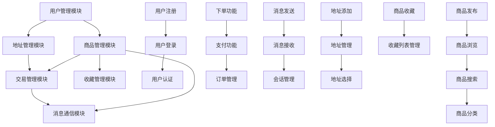

# 校内二手物品交易平台功能模块定义

## 项目信息
- **项目名称：** 校内二手物品交易平台
- **组员：** 肖一涵、刘鑫宇
- **创建时间：** 2024年
- **文档版本：** v1.0

---

## 1. 用户管理模块

### 1.1 用户注册功能
**功能描述：** 新用户通过学号进行实名注册

**子功能：**
- 学号验证：验证学号格式和有效性
- 信息填写：用户名、密码、真实姓名、手机号、邮箱
- 验证码验证：手机短信或邮箱验证
- 协议确认：用户协议和隐私政策确认
- 账户激活：通过邮箱或短信激活账户

**输入数据：** 学号、用户名、密码、真实姓名、手机号、邮箱  
**输出数据：** 注册成功/失败信息、用户ID

**业务规则：**
- 学号必须唯一且符合学校格式
- 用户名不能重复
- 密码强度要求（至少8位，包含字母和数字）
- 手机号和邮箱格式验证

### 1.2 用户登录功能
**功能描述：** 已注册用户通过多种方式登录系统

**子功能：**
- 账号密码登录：用户名/学号+密码
- 手机号登录：手机号+验证码
- 记住登录状态：自动登录功能
- 登录安全验证：异常登录检测

**输入数据：** 登录凭证（用户名/学号/手机号）、密码/验证码  
**输出数据：** 登录成功/失败信息、用户会话信息

**业务规则：**
- 连续登录失败5次锁定账户30分钟
- 记录登录日志和IP地址
- 更新最后登录时间

### 1.3 用户认证功能
**功能描述：** 验证用户身份和权限管理

**子功能：**
- 实名认证：学号与真实身份匹配
- 手机号验证：绑定和验证手机号
- 邮箱验证：绑定和验证邮箱
- 信用评级：基于交易行为的信用评分

**输入数据：** 认证信息、验证码  
**输出数据：** 认证状态、信用等级

**业务规则：**
- 初始信用分80分
- 成功交易+1分，违约行为-10分
- 信用分影响交易权限

---

## 2. 商品管理模块

### 2.1 商品发布功能
**功能描述：** 用户发布二手商品信息

**子功能：**
- 商品信息录入：标题、描述、价格、原价、新旧程度
- 图片上传：支持多张商品图片上传
- 分类选择：选择商品所属分类
- 交易地点设置：指定交易地点
- 发布审核：系统自动审核商品信息

**输入数据：** 商品标题、描述、价格、图片、分类、地点  
**输出数据：** 发布成功/失败信息、商品ID

**业务规则：**
- 价格必须大于0
- 最多上传9张图片，每张不超过5MB
- 标题长度限制100字符
- 描述长度限制1000字符

### 2.2 商品浏览功能
**功能描述：** 用户浏览和查看商品信息

**子功能：**
- 商品列表展示：分页显示商品列表
- 商品详情查看：查看商品详细信息
- 相关商品推荐：基于分类和浏览历史推荐
- 浏览历史记录：记录用户浏览过的商品
- 商品状态显示：在售/已售出/已下架状态

**输入数据：** 用户ID、分页参数、商品ID  
**输出数据：** 商品列表、商品详情、推荐商品

**业务规则：**
- 每页显示20个商品
- 记录商品浏览次数
- 只显示状态为"在售"的商品

### 2.3 商品搜索功能
**功能描述：** 用户通过关键词搜索商品

**子功能：**
- 关键词搜索：标题和描述全文搜索
- 分类筛选：按商品分类筛选
- 价格区间筛选：设置价格范围
- 新旧程度筛选：按商品成色筛选
- 排序功能：按价格、时间、浏览量排序
- 搜索历史：保存用户搜索记录

**输入数据：** 搜索关键词、筛选条件、排序方式  
**输出数据：** 搜索结果列表、搜索建议

**业务规则：**
- 支持模糊搜索和精确搜索
- 搜索结果按相关度排序
- 保存最近10次搜索记录

### 2.4 商品分类功能
**功能描述：** 商品分类管理和展示

**子功能：**
- 分类树展示：层级分类结构展示
- 分类商品统计：显示各分类商品数量
- 热门分类推荐：基于商品数量推荐热门分类
- 分类导航：快速定位到指定分类

**输入数据：** 分类ID、层级参数  
**输出数据：** 分类树结构、分类统计信息

**业务规则：**
- 支持二级分类结构
- 分类名称不能重复
- 删除分类时需要处理关联商品

---

## 3. 交易管理模块

### 3.1 下单功能
**功能描述：** 买家对商品下单购买

**子功能：**
- 商品选择确认：确认购买商品信息
- 收货地址选择：选择或新增收货地址
- 交付方式选择：面交或快递
- 订单信息确认：确认订单详情
- 订单生成：生成唯一订单号

**输入数据：** 商品ID、地址ID、交付方式、备注  
**输出数据：** 订单ID、订单号、订单详情

**业务规则：**
- 不能购买自己发布的商品
- 商品状态必须为"在售"
- 生成32位唯一订单号
- 订单创建后商品状态改为"已售出"

### 3.2 支付功能
**功能描述：** 订单支付处理

**子功能：**
- 支付方式选择：支付宝、微信、现金
- 支付金额确认：显示应付金额
- 支付状态跟踪：实时更新支付状态
- 支付超时处理：超时自动取消订单
- 支付凭证记录：记录支付流水

**输入数据：** 订单ID、支付方式、支付凭证  
**输出数据：** 支付状态、支付时间、交易流水号

**业务规则：**
- 订单创建后30分钟内必须支付
- 支付成功后不可取消订单
- 现金支付需要线下确认

### 3.3 订单管理功能
**功能描述：** 订单全生命周期管理

**子功能：**
- 订单状态跟踪：待支付、已支付、已发货、已完成、已取消
- 订单列表查看：买家和卖家订单列表
- 订单详情查看：查看订单完整信息
- 订单取消：支付前可以取消订单
- 确认收货：买家确认收到商品
- 订单评价：交易完成后互相评价

**输入数据：** 订单ID、操作类型、评价内容  
**输出数据：** 订单状态、操作结果

**业务规则：**
- 订单状态流转：待支付→已支付→已发货→已完成
- 确认收货后订单自动完成
- 7天后系统自动确认收货
- 评价影响信用分：1-5星分别为-10/-3/0/+1/+3

---

## 4. 消息通信模块

### 4.1 消息发送功能
**功能描述：** 用户之间发送消息沟通

**子功能：**
- 文本消息发送：发送文字消息
- 图片消息发送：发送图片消息
- 消息回复：回复指定消息
- 消息撤回：发送后2分钟内可撤回
- 消息转发：转发消息给其他用户

**输入数据：** 接收者ID、商品ID、消息内容、消息类型  
**输出数据：** 消息ID、发送状态

**业务规则：**
- 消息内容不能为空
- 图片大小限制5MB
- 消息长度限制500字符
- 记录消息发送时间

### 4.2 消息接收功能
**功能描述：** 接收和查看消息

**子功能：**
- 消息列表展示：显示会话列表
- 消息详情查看：查看具体消息内容
- 未读消息提醒：显示未读消息数量
- 消息已读标记：标记消息为已读
- 消息搜索：在消息中搜索关键词

**输入数据：** 用户ID、会话ID、搜索关键词  
**输出数据：** 消息列表、未读数量、搜索结果

**业务规则：**
- 按时间倒序显示消息
- 自动标记查看过的消息为已读
- 保留最近30天的消息记录

### 4.3 会话管理功能
**功能描述：** 管理用户间的会话

**子功能：**
- 会话创建：基于商品创建会话
- 会话列表：显示所有会话
- 会话置顶：重要会话置顶显示
- 会话删除：删除不需要的会话
- 会话免打扰：设置消息免打扰

**输入数据：** 会话ID、操作类型  
**输出数据：** 会话列表、操作结果

**业务规则：**
- 每个商品每对用户只能有一个会话
- 删除会话不影响对方的会话
- 置顶会话最多5个

---

## 5. 收藏管理模块

### 5.1 商品收藏功能
**功能描述：** 用户收藏感兴趣的商品

**子功能：**
- 添加收藏：将商品加入收藏夹
- 取消收藏：从收藏夹移除商品
- 收藏状态显示：显示商品是否已收藏
- 收藏数量统计：显示商品被收藏次数
- 收藏备注：为收藏商品添加备注

**输入数据：** 用户ID、商品ID、收藏备注  
**输出数据：** 收藏状态、收藏时间

**业务规则：**
- 不能收藏自己发布的商品
- 同一商品只能收藏一次
- 商品下架后收藏自动失效

### 5.2 收藏列表管理功能
**功能描述：** 管理用户的收藏列表

**子功能：**
- 收藏列表展示：显示所有收藏的商品
- 收藏分类管理：按分类查看收藏
- 收藏排序：按收藏时间、价格排序
- 批量操作：批量删除收藏
- 收藏提醒：商品降价或状态变更提醒

**输入数据：** 用户ID、排序方式、筛选条件  
**输出数据：** 收藏商品列表、统计信息

**业务规则：**
- 按收藏时间倒序显示
- 已售出商品在列表中标记
- 最多收藏1000个商品

---

## 6. 地址管理模块

### 6.1 地址添加功能
**功能描述：** 用户添加收货地址

**子功能：**
- 地址信息录入：收件人、电话、详细地址
- 地区选择：省市区三级联动选择
- 地址类型设置：宿舍、家庭、其他
- 默认地址设置：设置为默认收货地址
- 地址验证：验证地址格式和完整性

**输入数据：** 收件人姓名、电话、省市区、详细地址、地址类型  
**输出数据：** 地址ID、添加结果

**业务规则：**
- 收件人姓名不能为空
- 电话号码格式验证
- 详细地址长度限制200字符
- 每个用户最多20个地址

### 6.2 地址管理功能
**功能描述：** 管理用户的收货地址

**子功能：**
- 地址列表展示：显示所有收货地址
- 地址编辑：修改地址信息
- 地址删除：删除不需要的地址
- 默认地址管理：设置和更换默认地址
- 地址搜索：按关键词搜索地址

**输入数据：** 用户ID、地址ID、操作类型  
**输出数据：** 地址列表、操作结果

**业务规则：**
- 必须保留至少一个地址
- 默认地址只能有一个
- 删除地址前检查是否有未完成订单使用

### 6.3 地址选择功能
**功能描述：** 下单时选择收货地址

**子功能：**
- 地址列表显示：显示可选择的地址
- 地址快速选择：一键选择常用地址
- 临时地址添加：下单时临时添加新地址
- 地址信息确认：确认选择的地址信息
- 地址使用记录：记录地址使用频率

**输入数据：** 用户ID、订单信息  
**输出数据：** 可选地址列表、选择结果

**业务规则：**
- 优先显示默认地址
- 按使用频率排序显示
- 临时地址可选择是否保存

---

## 模块关系图

## 数据流向

### 主要业务流程
1. **买家流程：** 用户注册登录 → 商品浏览搜索 → 商品收藏/咨询 → 下单交易 → 消息沟通 → 交易完成
2. **卖家流程：** 用户注册登录 → 商品发布 → 商品管理 → 接收咨询 → 处理订单 → 交易完成

### 模块交互关系
- **用户管理模块** 为所有其他模块提供用户身份验证和权限控制
- **商品管理模块** 是系统的核心，与收藏、消息、交易模块都有密切关系
- **交易管理模块** 依赖地址管理模块提供收货地址信息
- **消息通信模块** 基于商品和用户建立沟通渠道
- **收藏管理模块** 增强用户体验，提供个性化服务

---

## 技术实现要点

### 数据库设计要求
- 所有模块功能必须使用原生SQL语句实现
- 支持事务处理确保数据一致性
- 合理设计索引提高查询性能
- 实现必要的存储过程和触发器

### 安全性考虑
- 用户密码加密存储
- 防止SQL注入攻击
- 用户权限控制
- 敏感信息脱敏处理

### 性能优化
- 数据库查询优化
- 图片存储和访问优化
- 缓存机制设计
- 分页查询实现

---

**文档创建时间：** 2025年  
**最后更新时间：** 2025年  
**文档状态：** 初版完成
