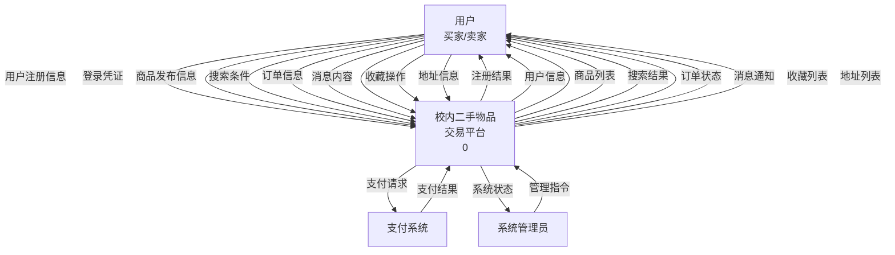
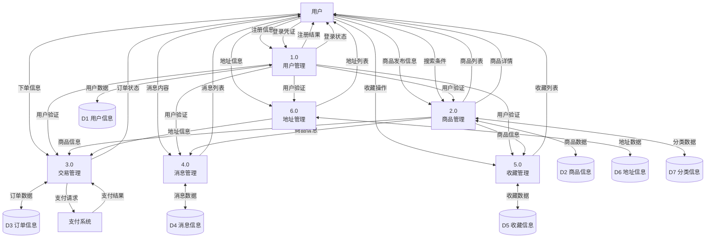
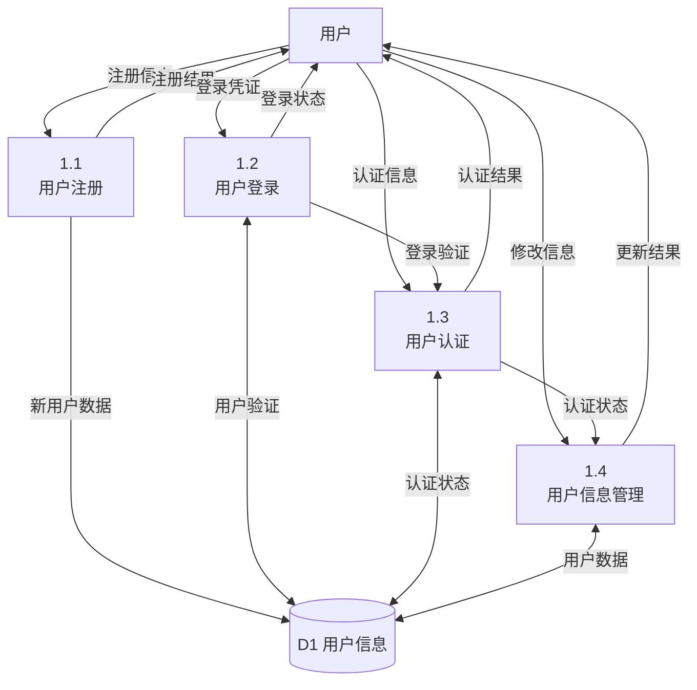
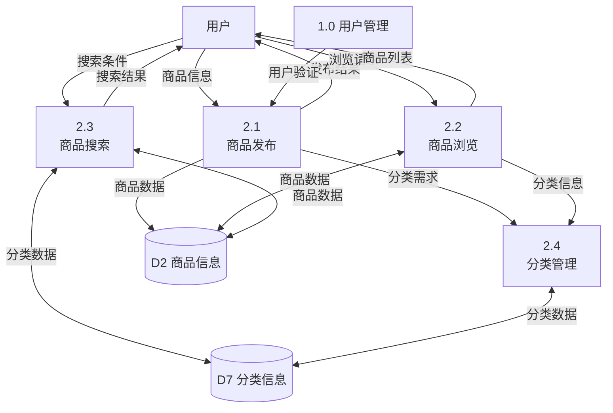
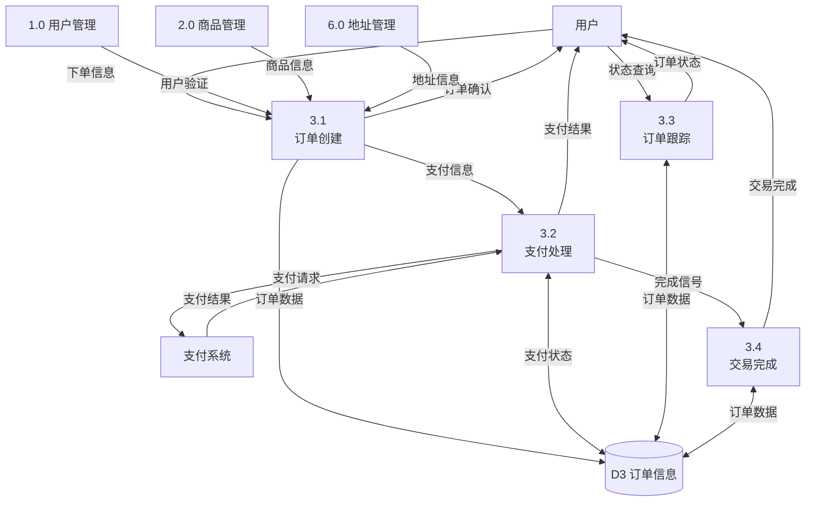

# 校内二手物品交易平台数据流图

## 项目信息
- **项目名称：** 校内二手物品交易平台
- **组员：** 肖一涵、刘鑫宇
- **文档类型：** 数据流图设计
- **创建时间：** 2024年

---

## 1. 顶层数据流图（0层DFD）

## 2. 一层数据流图（1层DFD）

## 3. 二层数据流图 - 用户管理（1.0分解）

## 4. 二层数据流图 - 商品管理（2.0分解）

## 5. 二层数据流图 - 交易管理（3.0分解）

## 6. 数据元素表

### 6.1 数据流定义

| 数据流名称 | 组成 | 说明 |
|-----------|------|------|
| 用户注册信息 | 学号+用户名+密码+真实姓名+手机号+邮箱 | 用户注册时提供的基本信息 |
| 登录凭证 | (用户名\|学号\|手机号)+密码 | 用户登录验证信息 |
| 商品发布信息 | 标题+描述+价格+图片+分类+地点 | 发布商品时的完整信息 |
| 搜索条件 | 关键词+分类+价格区间+排序方式 | 商品搜索的筛选条件 |
| 订单信息 | 商品ID+地址ID+支付方式+备注 | 创建订单的必要信息 |
| 消息内容 | 发送者ID+接收者ID+商品ID+内容+类型 | 用户间沟通的消息信息 |
| 收藏操作 | 用户ID+商品ID+操作类型+备注 | 收藏相关的操作信息 |
| 地址信息 | 收件人+电话+省市区+详细地址+类型 | 收货地址的完整信息 |

### 6.2 数据存储定义

| 数据存储 | 组成 | 说明 |
|----------|------|------|
| D1 用户信息 | 用户ID+学号+用户名+密码+个人信息+状态 | 存储所有用户的基本信息和状态 |
| D2 商品信息 | 商品ID+用户ID+分类ID+商品详情+状态 | 存储所有发布的商品信息 |
| D3 订单信息 | 订单ID+买家ID+卖家ID+商品ID+交易详情 | 存储所有交易订单信息 |
| D4 消息信息 | 消息ID+发送者ID+接收者ID+内容+状态 | 存储用户间的沟通消息 |
| D5 收藏信息 | 收藏ID+用户ID+商品ID+收藏时间 | 存储用户的商品收藏记录 |
| D6 地址信息 | 地址ID+用户ID+地址详情+类型 | 存储用户的收货地址信息 |
| D7 分类信息 | 分类ID+分类名称+父分类ID+描述 | 存储商品分类的层级结构 |

### 6.3 处理过程定义

| 处理过程 | 输入 | 输出 | 处理逻辑 |
|----------|------|------|----------|
| 1.1 用户注册 | 注册信息 | 注册结果+用户ID | 验证信息格式→检查重复→创建账户→发送确认 |
| 1.2 用户登录 | 登录凭证 | 登录状态+会话信息 | 验证凭证→检查状态→创建会话→记录日志 |
| 2.1 商品发布 | 商品信息+用户验证 | 发布结果+商品ID | 验证权限→检查信息→保存商品→更新索引 |
| 2.3 商品搜索 | 搜索条件 | 搜索结果 | 解析条件→执行搜索→排序结果→返回列表 |
| 3.1 订单创建 | 下单信息+验证信息 | 订单确认 | 验证商品→检查库存→创建订单→锁定商品 |
| 3.2 支付处理 | 支付信息 | 支付结果 | 调用支付接口→处理回调→更新状态→通知用户 |

## 7. 数据流图设计说明

### 7.1 设计原则
1. **分层设计**：采用自顶向下的分层设计方法，逐步细化
2. **数据守恒**：确保每层DFD的数据流保持一致性
3. **功能内聚**：每个处理过程具有单一、明确的功能
4. **接口简洁**：处理过程间的数据流简洁明了

### 7.2 符号说明
- **圆角矩形**：外部实体（用户、外部系统）
- **圆形**：处理过程（系统功能）
- **开口矩形**：数据存储（数据库表）
- **箭头**：数据流（数据传递方向）

### 7.3 数据流特点
1. **双向数据流**：用户与系统间存在交互式数据流
2. **数据验证**：所有输入数据都经过验证处理
3. **状态管理**：系统维护各种业务对象的状态
4. **异步处理**：支付等外部接口采用异步处理

### 7.4 系统边界
- **内部处理**：用户管理、商品管理、交易管理、消息管理、收藏管理、地址管理
- **外部接口**：支付系统接口
- **数据边界**：用户输入验证、系统输出格式化

---

## 8. DFD与数据库设计的对应关系

| DFD数据存储 | 对应数据库表 | 主要字段 |
|-------------|--------------|----------|
| D1 用户信息 | user | user_id, student_id, username, password |
| D2 商品信息 | item | item_id, user_id, category_id, title, price |
| D3 订单信息 | order | order_id, buyer_id, seller_id, item_id |
| D4 消息信息 | message | message_id, sender_id, receiver_id, content |
| D5 收藏信息 | wishlist | wishlist_id, user_id, item_id |
| D6 地址信息 | address | address_id, user_id, detailed_address |
| D7 分类信息 | category | category_id, category_name, parent_category_id |

---

**文档创建时间：** 2024年  
**最后更新时间：** 2024年  
**文档状态：** 初版完成  
**审核状态：** 待审核